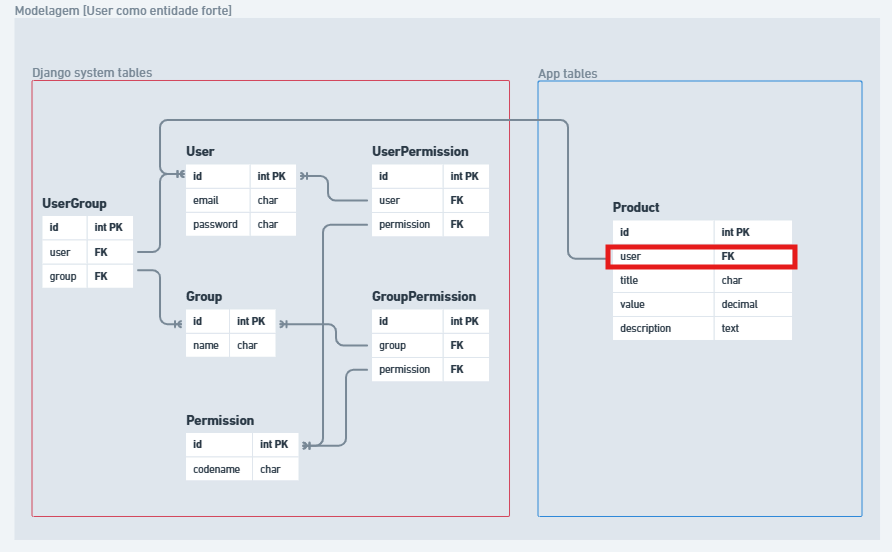
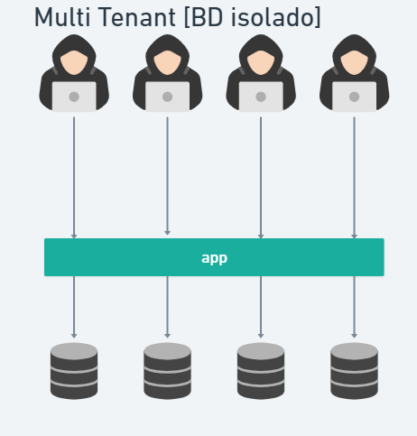
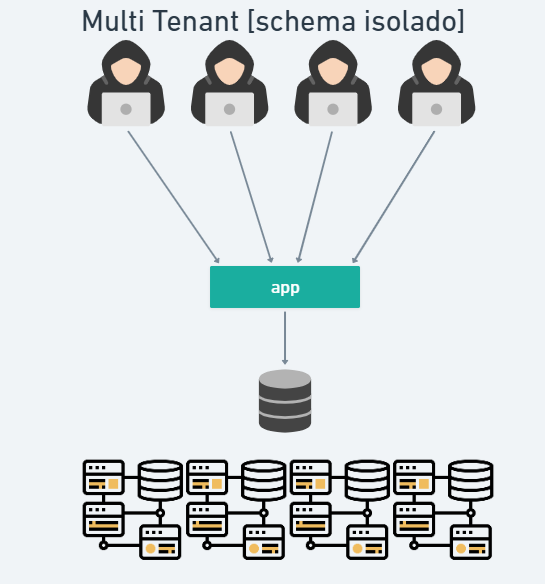
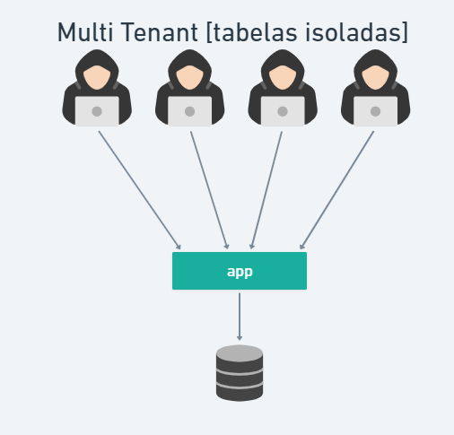

# Resumo Multi-tenant

Resumo dos tipos de isolamento em arquitetura multi-tenant.

## Modelagem das Entidades

A **Company** representa o tenant (organização/cliente), e o **User** representa o usuário que pertence a um tenant. Os diagramas abaixo ilustram a estrutura de cada entidade e como o relacionamento entre elas é estabelecido — geralmente via uma `ForeignKey` do User para a Company, garantindo que cada usuário esteja vinculado a um único tenant.

<figure style="max-width:800px;margin:0.5rem auto;">
  
  <figcaption style="text-align:center;font-size:0.9em;color:#555;">Modelagem — Company (tenant)</figcaption>
</figure>

<figure style="max-width:800px;margin:0.5rem auto;">
  
  <figcaption style="text-align:center;font-size:0.9em;color:#555;">Modelagem — User</figcaption>
</figure>

## 1. Multi-tenant [DB isolado]

- Múltiplos tenants compartilham a mesma instância da aplicação, mas possuem bancos separados.

<figure style="max-width:800px;margin:0.5rem auto;">
	
	<figcaption style="text-align:center;font-size:0.9em;color:#555;">Esquema — BD isolado</figcaption>
</figure>

## 2. Multi-tenant [Schema isolado]

- Múltiplos tenants compartilham a mesma instância da aplicação e o mesmo banco de dados, mas com esquemas diferentes.

<figure style="max-width:800px;margin:0.5rem auto;">
	
	<figcaption style="text-align:center;font-size:0.9em;color:#555;">Esquema — Schema isolado</figcaption>
</figure>

## 3. Multi-tenant [Tabelas isoladas]

- Múltiplos tenants compartilham a mesma instância da aplicação e o mesmo banco de dados, mas com tabelas diferentes.

<figure style="max-width:800px;margin:0.5rem auto;">
	
	<figcaption style="text-align:center;font-size:0.9em;color:#555;">Esquema — Tabelas isoladas</figcaption>
</figure>