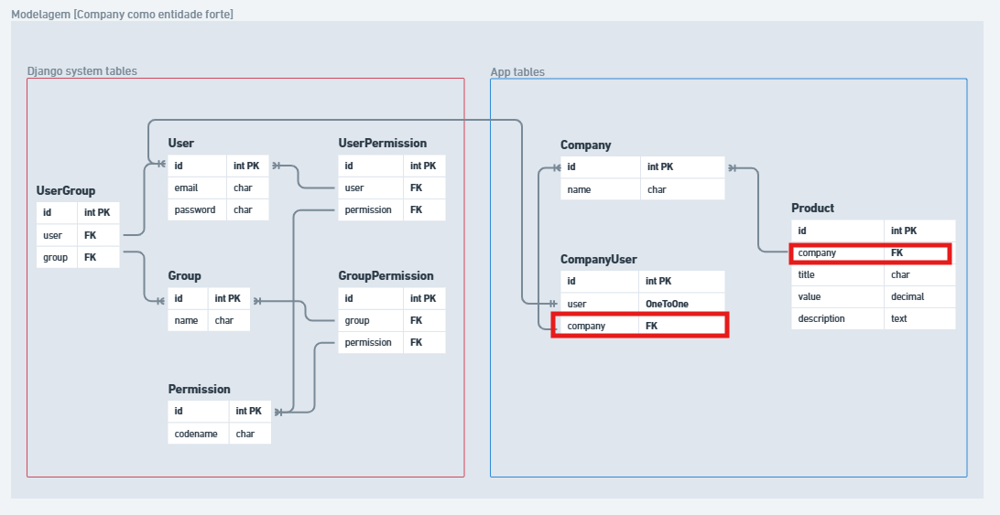

# Resumo Multi-tenant

Resumo dos tipos de isolamento em arquitetura multi-tenant.

## Modelagem das Entidades

A **Company** representa o tenant (organização/cliente), e o **User** representa o usuário que pertence a um tenant. Os diagramas abaixo ilustram a estrutura de cada entidade e como o relacionamento entre elas é estabelecido — geralmente via uma `ForeignKey` do User para a Company, garantindo que cada usuário esteja vinculado a um único tenant.

<figure style="max-width:800px;margin:0.5rem auto;">
  
  <figcaption style="text-align:center;font-size:0.9em;color:#555;">Modelagem — Company (tenant)</figcaption>
</figure>

<figure style="max-width:800px;margin:0.5rem auto;">
  
  <figcaption style="text-align:center;font-size:0.9em;color:#555;">Modelagem — User</figcaption>
</figure>

## 1. Multi-tenant [DB isolado]

- Múltiplos tenants compartilham a mesma instância da aplicação, mas possuem bancos separados.

<figure style="max-width:800px;margin:0.5rem auto;">
	
	<figcaption style="text-align:center;font-size:0.9em;color:#555;">Esquema — BD isolado</figcaption>
</figure>

## 2. Multi-tenant [Schema isolado]

- Múltiplos tenants compartilham a mesma instância da aplicação e o mesmo banco de dados, mas com esquemas diferentes.

<figure style="max-width:800px;margin:0.5rem auto;">
	
	<figcaption style="text-align:center;font-size:0.9em;color:#555;">Esquema — Schema isolado</figcaption>
</figure>

## 3. Multi-tenant [Tabelas isoladas]

- Múltiplos tenants compartilham a mesma instância da aplicação e o mesmo banco de dados, mas com tabelas diferentes.

<figure style="max-width:800px;margin:0.5rem auto;">
	
	<figcaption style="text-align:center;font-size:0.9em;color:#555;">Esquema — Tabelas isoladas</figcaption>
</figure>

---

# Docker

**Container:** caixa isolada com o suficiente para rodar a aplicação, usando os recursos do PC diretamente (sem dividir hardware, como faria uma VM).

## Componentes principais

- **Docker Engine:** motor que cria e gerencia os containers.
- **Docker Hub:** repositório online de imagens Docker.
- **Dockerfile:** receita de UMA imagem — define base, dependências, arquivos e comando de start.
- **Docker Compose:** orquestra VÁRIOS containers juntos (app + banco + cache, etc), cuidando de rede, volumes, variáveis de ambiente e dependências entre serviços.
## Dockerfile vs Compose

| | Dockerfile | Compose |
|---|---|---|
| Empacota | Seu código/app | Vários containers juntos |
| Define | Como construir UMA imagem | Como esses containers se conectam e rodam |
| Comando | `docker build -t nome .` | `docker compose up` |

**Fluxo real:** você escreve um Dockerfile pro seu app → escreve um `docker-compose.yml` que builda esse Dockerfile (`build: .`) e sobe outros serviços prontos (ex: MySQL) → roda `docker compose up` e tudo sobe conectado.

### Exemplo de Dockerfile
```dockerfile
FROM node:20
WORKDIR /app
COPY package.json .
RUN npm install
COPY . .
CMD ["node", "server.js"]
```

<figure style="max-width:800px;margin:0.5rem auto;">
  
  <figcaption style="text-align:center;font-size:0.9em;color:#555;">Camadas da imagem</figcaption>
</figure>

### Exemplo de docker-compose.yml
```yaml
services:
  app:
    build: .
    ports:
      - "3000:3000"
    depends_on:
      - db
  db:
    image: mysql:8
    environment:
      MYSQL_ROOT_PASSWORD: senha
```

## Comandos úteis

```powershell
docker ps -a                    # listar todos os containers
docker system prune -a          # deletar containers, imagens, volumes e redes não usados
docker exec -it <container> /bin/bash  # acessar shell de um container
docker compose up --build       # buildar e subir os serviços
docker compose up               # apenas subir os serviços
```

---

# Ambientes Virtuais (venv)

**venv:** ambiente isolado que cria uma cópia independente do Python para um projeto específico, com suas próprias dependências e versões de pacotes, sem interferir no Python global do sistema nem em outros projetos.

## Vantagens

- Gerenciar dependências
- Versões
- Pacotes
- Sem conflitos entre projetos diferentes

## Criar e ativar um ambiente (Windows)

```powershell
python -m venv venv
.\venv\Scripts\activate
```

Para sair do ambiente ativo, use `deactivate`. Depois disso, é só ativar de novo com `.\venv\Scripts\activate` quando precisar.

```powershell
deactivate
.\venv\Scripts\activate
```

## Criar e ativar um ambiente (macOS/Linux)

```bash
python3 -m venv my_env
source my_env/bin/activate
```

## Instalar pacotes e salvar dependências

Depois de ativar o ambiente, os pacotes instalados ficam isolados dentro dele:

```bash
pip list
pip install -r requirements.txt
```

Para gerar o arquivo de dependências do projeto (usado pelo `pip install -r`):

```bash
pip freeze > requirements.txt
```

## Resumo

- Criar um ambiente
- Ativar um ambiente
- Instalar pacotes individualmente
- Instalar pacotes a partir de um arquivo
- Salvar os pacotes